# 计算机组成与设计－绪论1

李瑞 教授

蒋志平 副教授

计算机科学与技术学院

# 课程简介

# 教材

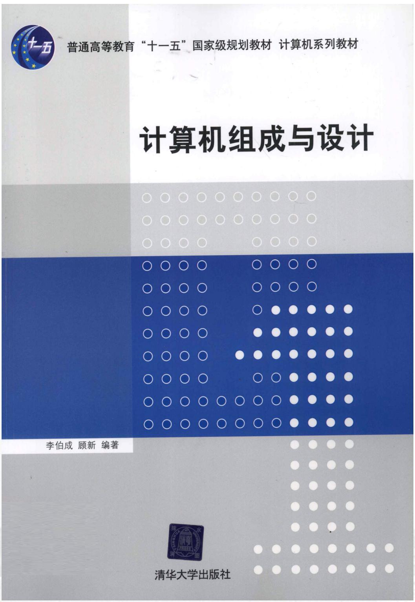

text_image

十一五 普通高等教育“十一五”国家级规划教材 计算机系列教材
计算机组成与设计
李伯成 顾新 编著
清华大学出版社

教材PDF在“学在西电”->本课程->资料

• Computer Organization & Design (COD)   
- 不是Activision的CoD...  
- by 李伯成 顾新

• 李老师2019年末退休，执教54载

natural_image

Two people interacting indoors, one holding a bouquet of flowers; no visible text or symbols.

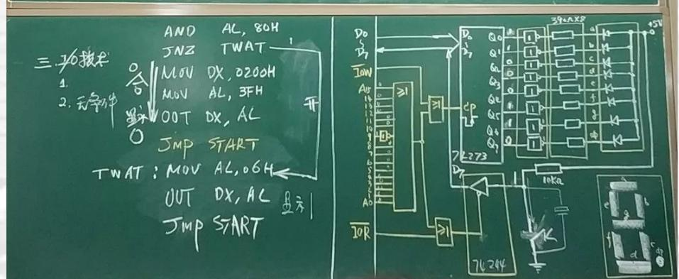

text_image

三.1/6接头
1.
2.无条件
AND AL, 80H
JNZ TWAT
MOV DX, 0200H
MOV AL, 3FH
OUT DX, AL
JMP START
TWAT: MOV AL, 06H
OUT DX, AL
JMP START
D0
B7
IOW
Aur
10kA
10kA
10kA
10kA
10kA
10kA
10kA
10kA
10kA
10kA
10kA
10kA
10kA
10kA
10kA
10kA
10kA
10kA
10kA
10kA
10kM
394AX8
Q0
Q1
Q2
Q3
Q4
Q5
Q6
Q7
CP
7K273
D7
10kA
7K294

# 教学内容

1、绪论  
2、计算机中的数据表示  
3、运算方法与运算器  
4、存储系统（部分）  
5、指令系统与汇编语言  
6、处理器（CPU）设计  
7、流水线技术  
8、输入输出系统  
9、多机系统

# 计算机组成与结构I

\*因为教学大纲中不包括Design部分，所以才起名“计算机组成与结构”

# 计算机组成与结构II (下学期课程)

# COD课程的作用

\- 它是对各种计算机（主要指硬件系统）进行深入理解的最佳课程。能够使我们比较深入的了解作为复杂电子设备工作的基本原理和思想。使机盖内的秘密不再神秘。

\- 计组，汇总之前所有学过的硬件相关内容，通过指令系统，为上层软件提供平台，承上启下。

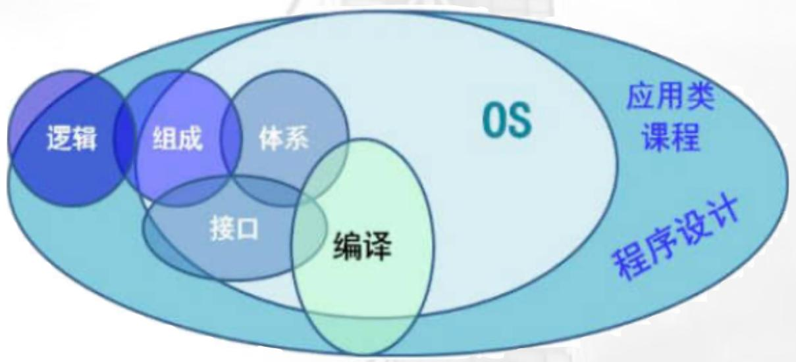

text_image

逻辑
组成
体系
接口
OS
编译
应用类
课程
程序设计

# COD课程的作用

IEEE CS（IEEE计算机学会）与ACM（美国计算机协会）共同组织的Joint Task Force on Computing Curricula制定了新世纪第一个计算机课程大纲，这被称为IEEE/ACM Computer Curricula 2001，此大纲将计算机体系结构列为必修的核心课程之一，并在有关报告中指出：

.... 要求所有的计算机专业学生对计算机系统功能部件，它们的特征、性能，以及之间的相互作用有某种程度的理解和评估。当然，这里也有实践的关联性。学生需要理解计算机体系结构，以便更好地编制程序使其能在实际机器上高效运行，在选择欲使用的系统时，他们应能理解各种部件间的权衡考虑，如时钟速率与内存的大小……

# 计算机体系结构 v.s 计算机组成与设计

\- 计算机体系结构(Computer Architecture)

\- “程序员可见的机器属性”

• by G. M. Amdahl, 1964

\- 特指机器语言的程序员

\- C/C++/Java/Python等
不要给自己加戏..

\- 计算机组成与设计(Computer Organization & Design)

\- 体系结构的逻辑实现

\- 硬件层面的数据流、控制流和逻辑设计；

\- 内部各事件的控制方式、联系方面等；

\- 从内部研究计算机的构成，涉及运算、CPU、存储、I/O等...

# 计算机体系结构(Computer Architecture)

计算机系统结构：由(系统)程序员所看到的计算机系统的属性，即概念性结构及功能特性。

- 数据的表示形式；  
- 内部寄存器组；  
- 指令集；  
- 中断系统;  
- 存储系统;  
- 输入/输出结构;  
●
■ ■ ■

# 计算机组成与设计(COD)

\- COD: 计算机系统的逻辑实现，包括最低层内部算法、数据流、控制流的逻辑实现。

- 数据通路的宽度;   
- 专用部件的设置（如乘除法专用部件、浮点运算专用部件等等）；   
- 各功能部件的并行程度；  
- 各种操作的相容性与互斥性；  
- 缓冲与排队技术的应用；  
- 预估、预判方法；  
●
■ ■ ■

# 计算机体系结构 v.s 计算机组成与设计

• 例一：Intel i9和Apple M3Max
两种CPU

- 高级语言程序员:没有区别;  
- 汇编语言程序员:完全不同的两种CPU，指令/寄存器全不同;  
- 以上是体系结构的问题

• 例二：Intel i9比Apple M3Max CPU多了AVX256指令集，M3Max 比i7多了NEON指令集、专用的 Neural PU (NPU)单元

- AVX指令集如何实现?  
- NEON指令集如何实现？  
- NPU的构造?

\- 以上都是COD问题

# COD灵魂三问: What, How, Why...

- 它是什么？  
- 它怎么工作的？  
- 为啥这样设计？

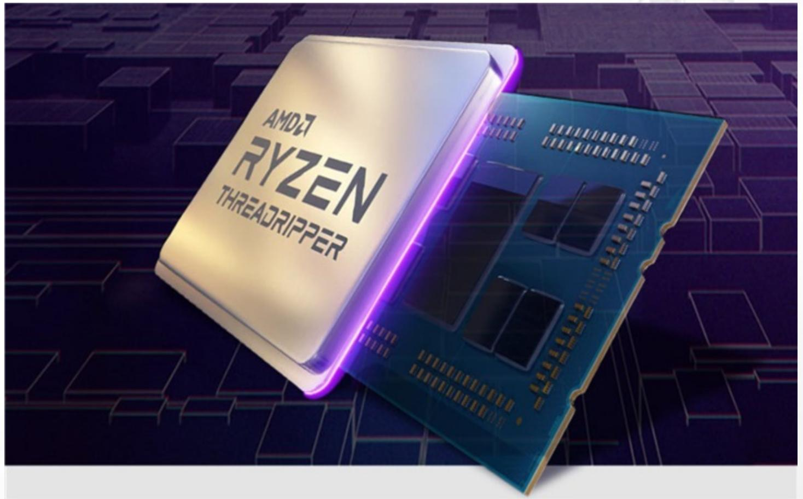

text_image

AMD4
RYZEN
THREADRIPPER

# COD, Always in beta...

• COD有着非常持久又专一的追求♥:

- 如何设计出更好的计算机...  
- 如何设计出更快的计算机...  
- 如何设计出更x/x/x/x/x/x的计算机...  
- 如何把现有计算更高效利用...

\- 计算机的发展日新月异，COD课程也跟着走。

<table><tr><td>上课节次</td><td>上课主题/内容</td><td>教材对应</td><td>授课人</td><td>备注</td></tr><tr><td>1</td><td>绪论1</td><td rowspan="2">第一章 绪论</td><td rowspan="26">应该全是我</td><td rowspan="11"></td></tr><tr><td>2</td><td>绪论2</td></tr><tr><td>3</td><td>数制表示1</td><td rowspan="4">第二章 计算机中的数据表示</td></tr><tr><td>4</td><td>数制表示2</td></tr><tr><td>5</td><td>数制表示3</td></tr><tr><td>6</td><td>第一、二章习题课</td></tr><tr><td>7</td><td>数制计算1</td><td rowspan="5">第三章 运算方法与运算器</td></tr><tr><td>8</td><td>数制计算2</td></tr><tr><td>9</td><td>数制计算3</td></tr><tr><td>10</td><td>数制计算4</td></tr><tr><td>11</td><td>数制计算习题课</td></tr><tr><td>12</td><td>期中考试</td><td>不一定考</td><td>考前三章</td></tr><tr><td>13</td><td>存储系统1</td><td rowspan="4">第四章 存储系统部分内容</td><td rowspan="4"></td></tr><tr><td>14</td><td>存储系统2</td></tr><tr><td>15</td><td>存储系统3</td></tr><tr><td>16</td><td>存储系统习题课</td></tr><tr><td>17</td><td>指令系统1</td><td rowspan="6">第四章 指令系统与汇编语言</td><td>布置汇编语言编程大作业,分组完成</td></tr><tr><td>18</td><td>指令系统2</td><td rowspan="3"></td></tr><tr><td>19</td><td>指令系统3</td></tr><tr><td>20</td><td>指令系统4</td></tr><tr><td>21</td><td>指令系统实验课</td><td>分组上台讲代码+demo</td></tr><tr><td>22</td><td>指令系统习题课</td><td rowspan="4"></td></tr><tr><td>23</td><td>CPU设计1</td><td rowspan="3">第五章 处理器(CPU)设计</td></tr><tr><td>24</td><td>CPU设计2</td></tr><tr><td>25</td><td>CPU设计习题课</td></tr><tr><td>26</td><td>课题总复习</td><td>13</td><td>总结复习本学习课程</td></tr></table>

# 课程考核

\- 平时成绩： $20 \%$

- 各章作业5-10%  
- 汇编语言分组大作业10-15%

\- 考试： $80 \%$ （闭卷）

- 历年试卷都是100+10附加分  
- 从19年起，全部是简答题，约15道左右  
- 从22年起，又改回去了（选择、简答、大题等）

\- 根据签到, 取消末位考试资格, 降低挂科率😊 (JWC就是我们的神! - \_ - !)

# 课程考核

\- 根据历年经验...

\- 计组I挂科率很高>30%，即使算上附加分

\- 虽然课程难度更高一些，计组II比计组I挂科率低10%...

\- 往往影响保研!

\- Why ? 😂 😂 😂 😂

- 计组，综合难度较高  
- 知识点繁多，计算、练习要求高...

\- 根据教学要求，考试至少包含15%上课未覆盖内容...

# 历史

# - 第1代—电子管计算机

第1代计算机从1946年到1954年。这一代计算机是由电子管、电磁继电器等器件构成。软件主要使用机器语言编程。典型机器有ENIAC、IBM 701等。

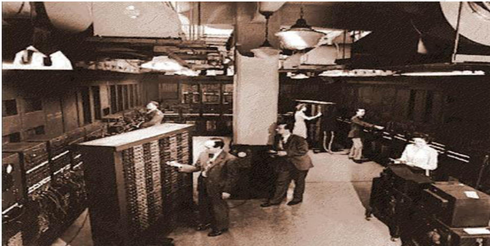

natural_image

Historic black-and-white photo of a vintage computer room with multiple workstations and operators (no visible text or signage)

# - 第2代—晶体管计算机

第2代计算机所在年代为1955年到1964年。这一代计算机采用晶体管、磁芯存储器等构成。软件上有了监控程序对计算机进行管理，并且开始使用高级语言。这个时期的计算机有很多种，如IBM 7030、Univac LARC等。

# - 第3代—集成电路计算机

从1965年到1974年。这代计算机利用小规模及中规模集成电路芯片，多层印刷电路板及磁芯存储器等构成。在软件上，高级语言迅速发展并出现了分时操作系统。在这个时期里，计算机的应用领域不断扩展，开始向国民经济各部门及军事领域渗透。典型机器如IBM 360、370，DEC PDP-8等等。

# - 第4代—超大规模集成电路计算机

从1975年到1990年出现第4代计算机，特点是：大规模、超大规模集成电路构成，主存也是由超大规模集成电路构成的半导体存储器来实现。典型的计算机有：IBM 3090，VAX 9000，PC机、苹果机等。

软件有如DOS、Windows、Unix等。

# - 第5代—高性能智能计算机

从1991年开始，进入了计算机发展的第5代，采用超大规模、超高速集成电路构成计算机。在结构上，构成计算机已从单处理器向多处理器发展。既使构成微型机也采用多核处理器，目前常见的是双核处理器和4核处理器。用这样的多核处理器构成计算机可获得很高的性能。

# 摩尔定律

\- 集成电路芯片的集成度每18个月翻一番。

Gordon E. Moore, Intel公司的创始人之一

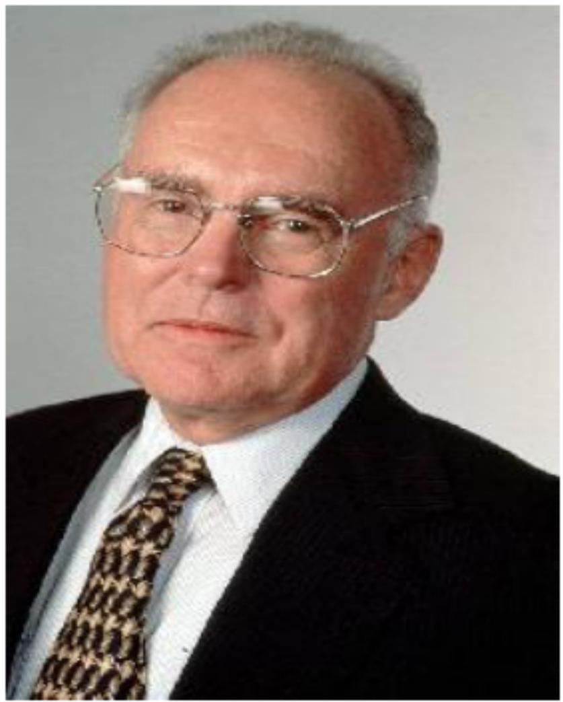

natural_image

Portrait of an older man wearing glasses and a suit (no text or symbols visible)

# Fairchild Semiconductor Corporation

- 仙童半导体公司（飞兆半导体公司）  
● 与德克萨斯仪器公司（TI）共同拥有集成电路发明专利。  
- “仙童半导体公司就象个成熟了的蒲公英，你一吹它，这种创业精神的种子就随风四处飘扬了。”
-- Steve Jobs

查尔斯·斯波克(总经理)、杰里·桑德斯：1967年出走，在国家半导体公司(National Semiconductor Corporation)担任CEO；

诺依斯、摩尔(研发部主管)、葛罗夫：1968年，脱离仙童公司自立门户，创办Intel公司。

桑德斯(销售部主任): 1969年, 带着7位仙童员工创办AMD公司。

# Fairchild Semiconductor Corporation

THE CREATION OF SILICON VALLEY: GROWTH OF THE LOCAL COMPUTER CHIP INDUSTRY   
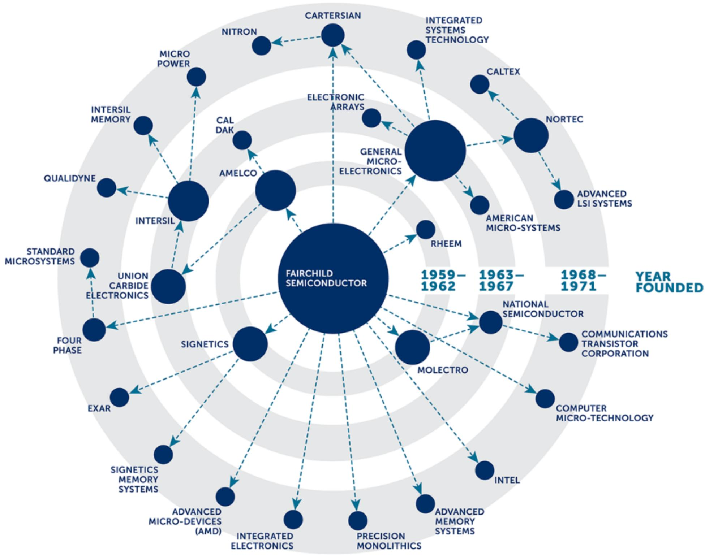

network

| Technology | Year Founded |
| --- | --- |
| CARTERSIAN | 1959-1962 |
| INTEGRATED SYSTEMS TECHNOLOGY | 1963-1967 |
| CALTEX | 1968-1971 |
| NORTEC | 1968-1971 |
| AMERICAN MICRO-SYSTEMS | 1968-1971 |
| GENERAL MICRO-ELECTRONICS | 1963-1967 |
| ELECTRONIC ARRAYS | 1959-1962 |
| NITRON | 1959-1962 |
| CITRISAI | 1959-1962 |
| NITRON | 1959-1962 |
| AMELCO | 1959-1962 |
| MEMOTRO | 1963-1967 |
| RHEEM | 1963-1967 |
| MEMOTRO | 1963-1967 |
| CAMBRIDGE ELECTRONICS | 1963-1967 |
| COMMUNICATIONS TRANSISTOR CORPORATION | 1968-1971 |
| NATIONAL SEMICONDUCTOR | 1963-1967 |
| MOLECTRO | 1963-1967 |
| MILENETICS | 1963-1967 |
| SIGNETICS | 1963-1967 |
| STANDARD MICROSYSTEMS | 1959-1962 |
| QUADYNE | 1959-1962 |
| INTERISIL | 1959-1962 |
| INTERISIL MEMORY | 1959-1962 |
| EXAR | 1959-1962 |
| SIGNETICS MEMORY SYSTEMS | 1959-1962 |
| STANDARD MICROSYSTEMS | 1959-1962 |
| FOUR PHASE | 1959-1962 |
| UNION CARBIDE ELECTRONICS | 1959-1962 |
| PRECISION MONOLITHICS | 1959-1962 |
| INTEGRATED ELECTRONICS | 1959-1962 |
| COMMUNICATIONS TRANSISTOR CORPORATION | 1968-1971 |
| COMPUTER MICRO-TECHNOLOGY | 1968-1971 |
| INTEL | 1968-1971 |
| ADVANCED MICRO-DEVICES (AMD) | 1959-1962 |
| PRECISION MONOLITHICS | 1959-1962 |
| COMMUNICATIONS TRANSISTOR CORPORATION | 1968-1971 |
| INDIAOLOGIES | 1959-1962 |
| INDIAOLOGIES | 1959-1962 |
| AMELCO | 1959-1962 |
| AMELCO | 1959-1962 |
| CAMDAK | 1959-1962 |
| CAMDAK | 1959-1962 |
| INTERISIL | 1959-1962 |
| INTERISIL MEMORY | 1959-1962 |
| NITRON | 1959-1962 |
| MEMOTRO | 1959-1962 |
| MEMOTRO | 1959-1962 |
| MEMOTRO | 1959-1962 |
| MEMOTRO | 1959-1962 |
| MEMOTRO | 1959-1962 |
| MEMOTRO | 1959-1962 |
| MEMOTRO | 1.0000000000000000000000000000000000000000000000000000000000000000000000000000000000000000000000000000 |

摩尔定律  
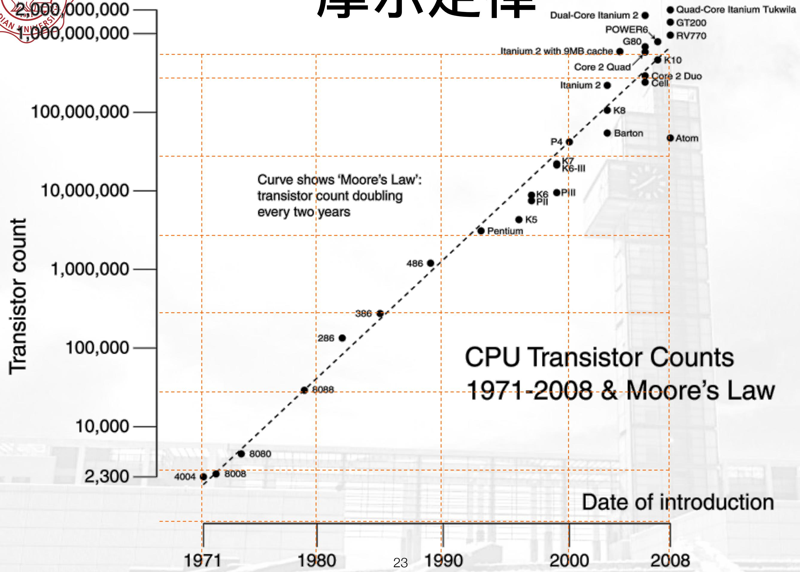

line

| Year | Transistor Count |
| ---- | ---------------- |
| 1971 | 4004             |
| 1973 | 8008             |
| 1975 | 8080             |
| 1978 | 8088             |
| 1980 | 286              |
| 1982 | 386              |
| 1985 | 486              |
| 1990 | Pentium          |
| 1995 | K5               |
| 1997 | PII              |
| 1998 | K6               |
| 1999 | K7               |
| 2000 | K6-III           |
| 2001 | K8               |
| 2002 | K8               |
| 2003 | K10              |
| 2004 | Core 2 Quad      |
| 2005 | Core 2 Duo       |
| 2006 | Cell             |
| 2007 | Atom             |
| 2008 | Dual-Core Itanium Tukwila |

# 摩尔定律

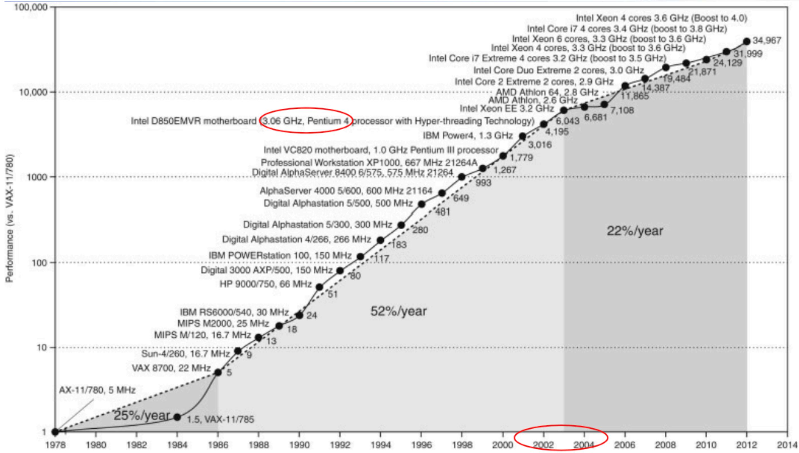

line

| Processor | Performance (vs. VAX-11/780) |
| :--- | :--- |
| AX-11/780, 5 MHz | 1 |
| 25%/year | 2 |
| Sun-4/260, 16.7 MHz | 5 |
| VAX 8700, 22 MHz | 9 |
| MIPS M/120, 16.7 MHz | 13 |
| MIPS M2000, 25 MHz | 18 |
| IBM RS6000/540, 30 MHz | 24 |
| Digital Alphastation 4/266, 266 MHz | 183 |
| Digital AlphaServer 8400 6/575, 575 MHz | 21264 |
| Digital AlphaServer 5/500, 500 MHz | 481 |
| Digital Alphastation 5/300, 300 MHz | 280 |
| Digital Alphastation 5/300, 300 MHz | 649 |
| IBM PowerStation 100, 150 MHz | 117 |
| Digital AlphaServer 8400 6/575, 575 MHz | 21264 |
| Digital AlphaServer 4/266, 266 MHz | 183 |
| Digital Alphastation 5/300, 300 MHz | 280 |
| Digital Alphastation 5/300, 300 MHz | 481 |
| IBM Power4, 1.3 GHz | 3,016 |
| IBM Power4, 1.3 GHz (Intel Core 2 Extreme 2 cores, 2.9 GHz) | 4,195 |
| Intel VC820 motherboard, 1.0 GHz Pentium III processor | 1,779 |
| Professional Workstation XP1000, 667 MHz | 21264A |
| Intel D850EMVR motherboard (3.06 GHz, Pentium 4 processor with Hyper-threading Technology) | 6,043 |
| AMD Athlon 64, 2.8 GHz | 14,387 |
| AMD Athlon, 2.6 GHz | 6,681 |
| Intel Xeon EE 3.2 GHz | 7,108 |
| Intel Core Duo Extreme 2 cores, 3.0 GHz | 3.0 GHz |
| Intel Core i7 Extreme 4 cores 3.2 GHz (boost to 3.5 GHz) | - |
| Intel Core i7 4 cores 3.4 GHz (boost to 3.6 GHz) | - |
| Intel Core i7 cores (boost to 3.6 GHz) | - |
| Intel Xeon 4 cores 3.6 GHz (Boost to 4.0) | - |
| Intel Core i7 cores (boost to 3.8 GHz) | - |
| Intel Xeon 6 cores, 3.3 GHz (boost to 3.6 GHz) | - |
| Intel Xeon 4 cores, 3.3 GHz (boost to 3.6 GHz) | - |
| Intel Core i7 cores (boost to 3.6 GHz) | - |
| Intel Core i7 cores (boost to 3.6 GHz) | - |
| Intel Core i7 cores (boost to 3.6 GHz) | - |
| Intel Core i7 cores (boost to 3.6 GHz) | - |
| Intel Core i7 cores (boost to 3.6 GHz) | - |
| Intel Core i7 cores (boost to 3.6 GHz) = Intel Core i7 cores (boost to 3.6 GHz) | - |
| Intel Core i7 cores (boost to 3.6 GHz) = Intel Core i7 cores (boost to 3.6 GHz) | - |
| Intel Core i7 cores (boost to 3.6 GHz) = Intel Core i7 cores (boost to 3.6 GHz) | - |
| Intel Core i7 cores (boost to 3.6 GHz) = Intl Core i7 cores (boost to 3.6 GHz) | - |
| Intel Core i7 cores (boost to 3.6 GHz) = Intl Core i7 cores (boost to 3.6 GHz) | - |
| Intel Core i7 cores (boost to 3.6 GHz) = Intl Core i7 cores (boost to 3.6 GHz) | - |
| Intel Core i7 cores (boost to 3.6 GHz) = Intl Xeon I x II Extreme 4 cores (boost to 3.5 GHz) | - |
| Intel Core i7 core (boost to 3.5 GHz) = Intl Xeon I x II Extreme 4 cores (boost to 3.5 GHz) | - |
| Intel Core i7 core (boost to 3.5 GHz) = Intl Xeon I x II Extreme 4 cores (boost to 3.5 GHz) | - |
| Intel Core i7 core (boost to 3.5 GHz) = Intl Xeon I x II Extreme 4 cores (boost to 3.5 GHz) | +19,484 |
| Intel Core i7 core (boost to 3.5 GHz) = Intl Xeon I x II Extreme 4 cores (boost to 3.5 GHz) | +14,387 |
| Intel Core i7 core (boost to 3.5 GHz) = Intl Xeon I x II Extreme 4 core (boost to 3.5 GHz) | +11,865 |
| Intel Core i7 core (boost to 3.5 GHz) = Intl Xeon I x II Extreme 4 core (boost to 3.5 GHz) | +6,681 |
| Intel Core i7 core (boost to 3.5 GHz) = Intl Xeon I x II Extreme 4 core (boost to 3.5 GHz) | +19,484 |
| Intel Core i7 core (boost to 3.5 GHz) = Intl Xeon I x II Extreme 4 core (boost to 3.5 GHz) | +21,871 |
| Intel Core i7 core (boost to 3.5 GHz) = Intl Xeon I x II Extreme 4 core (boost to 3.5 GHz) | +24,129 |
| Intel Core i7 core (boost to 3.5 GHz) = Intl Xeon I x II Extreme 4 core (boost to 3.5 GHz) | +21,871 |
| Intel Core i7 core (boost to 3.5 GHz) = Intl Xeon I x II Extreme 4 core (boost to 3.5 GHz) | +24,129 |
| Intel Core i7 core (boost to 4.0) = Intl Xeon I x II Extreme IV core (boost to ~2 Hz) | - |
| Intel Core i7 core (boost to ~2 Hz) = Intl Xeon I x II Extreme IV core (boost to ~2 Hz) | - |
| Intel Core i7 core (boost to ~2 Hz) = Intl Xeon I x II Extreme IV core (boost to ~2 Hz) | - |
| Intel Core i7 core (boost to ~2 Hz) = Intl Xeon I x II Extreme IV core (boost to ~2 Hz) | - |
| Intel Core i7 core (boost to ~2 Hz)(Intel Corei IX / Extreme I x II Extreme IV core I x II Extreme IV core I x II Extreme IV core I x II Extreme IV core I x II Extreme IV core I x II Extreme IV core I x II Extreme IV core I x II Extreme IV core I x II Extreme IV core I x II Extreme IV core I x II Extreme IV core I x II Extreme IV core I x II Extreme IV core I x II Extreme IV core I x II Extreme IV core I x II Extreme IV core I x II Extreme IV core I x II *<nl>

# 摩尔定律

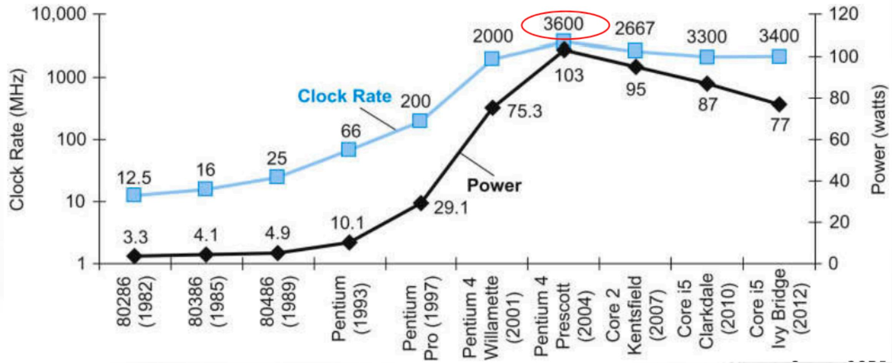

bar_line

| Processor | Clock Rate (MHz) | Power (watts) |
| --------- | ---------------- | ------------- |
| 80286 (1982) | 12.5 | 3.3 |
| 80386 (1985) | 16 | 4.1 |
| 80486 (1989) | 25 | 4.9 |
| Pentium (1993) | 66 | 10.1 |
| Pentium Pro (1997) | 200 | 29.1 |
| Pentium 4 Willamette (2001) | 2000 | 75.3 |
| Pentium 4 Prescott (2004) | 3600 | 103 |
| Core 2 Kentsfield (2007) | 2667 | 95 |
| Core i5 Clarkdale (2010) | 3300 | 87 |
| Core i5 Ivy Bridge (2012) | 3400 | 77 |

- Power wall, 功耗墙阻挡了摩尔定律   
- 向多核发展，制程、工艺也在不断改进

amd x3990的最新相关信息

<table><tr><td>“框框”太多了!Windows 10 将AMD 3990X识别成两个... IT之家</td><td>50分钟前</td></tr><tr><td>IT之家2月8日消息 昨天晚上,AMD宣布线程撕裂者3990X开卖,64核128线程,售价为29999元。现在,外媒AnandTech也拿到了一颗3990X,并上机进行了测试。如...</td><td></td></tr><tr><td>AMD线程撕裂者3990X跑分测试:CineBench R20 16秒跑完 IT之家</td><td>50分钟前</td></tr><tr><td>AMD 64核线程撕裂者3990X创新纪录:液氮全核5.5GHz 新浪</td><td>22小时前</td></tr><tr><td>29999元!AMD 64核心线程撕裂者3990X正式上市 快科技</td><td>19小时前</td></tr><tr><td>AMD Ryzen Threadripper 3990X外媒评测汇总:服务器C... 超 超能网</td><td>9小时前</td></tr></table>

# 计算机软件系统

# 软件系统

# - 系统软件

\- 操作系统:

- 管理计算机硬/软件资源，控制程序运行，改善人机交互，为应用软件提供支持  
- 处理器管理、存储管理、文件管理、设备管理、作业管理

\- 语言处理程序

\- 各种服务支持软件

\- 调试程序、诊断程序、提示警告程序

\- 应用软件：用户在各自的应用中，为解决自己的有关问题而编写的程序。

\- 科学计算、信息管理、过程控制、武器装备

# 计算机 组成原理

# 计算机 系统结构

# 系统软件

# 应用软件

# 应用语言

6

# 高级语言

5

# 汇编语言

4

# 操作系统

3

# 机器语言

2

机器指令系统

中央
处理器

第机器计

机器程序

机器语言程序员

# 软硬件分界

# 微程序

1

# 硬联逻辑

0

硬操作时序

硬联逻辑

第1级

微程序控制

寄存器传送门

逻辑设计员

第0级
硬联逻辑

逻辑线路
内核

硬件维护员
设计员

# 硬件

# 虚拟机

# 云计算时代的软件系统

\- 云计算是未来的计算模式

- 硬件资源的融合与弹性配置   
- 软件功能的模块化与封装

\- 两种实现方式/取向：

- 虚拟化 Virtualization  
- 容器化 Containerization

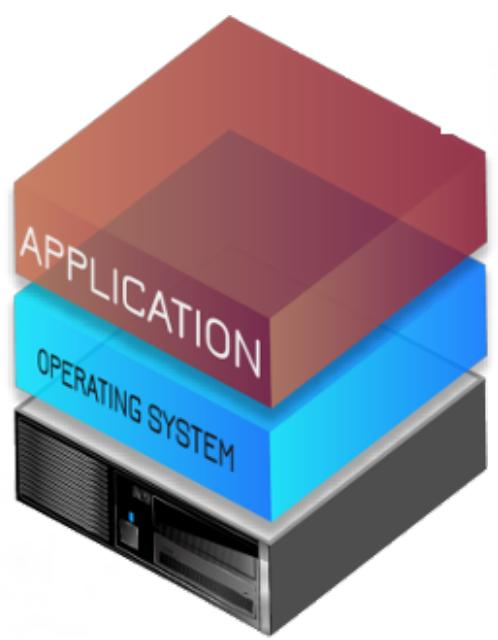

text_image

APPLICATION
OPERATING SYSTEM

Traditional Server Architecture

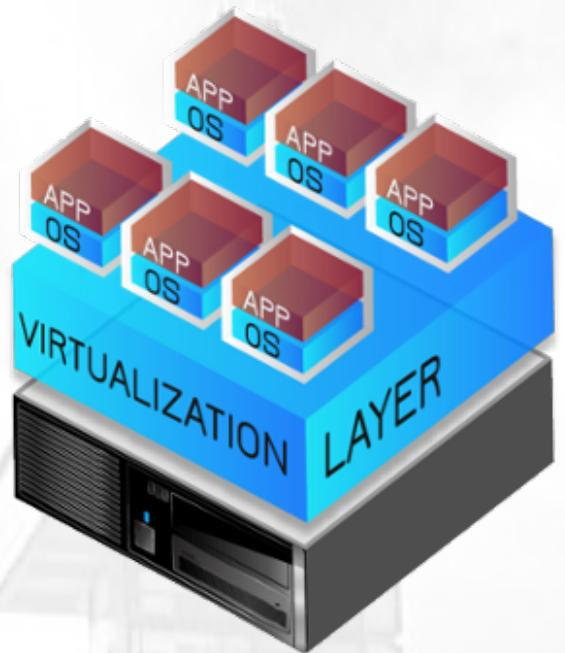

text_image

APP OS
APP OS
APP OS
APP OS
VIRTUALIZATION
LAYER

Virtualized Server Architecture

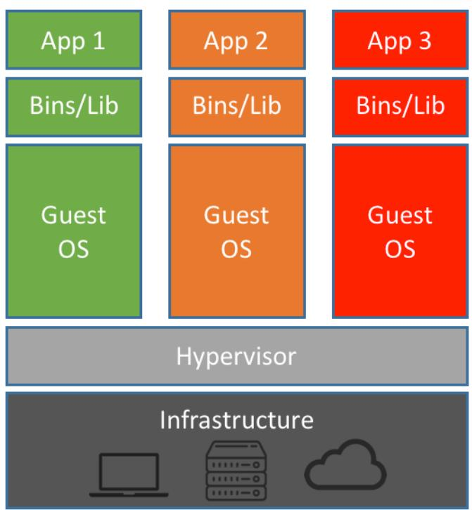

flowchart

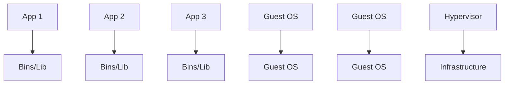
```mermaid
graph TD
    A["App 1"] --> B["Bins/Lib"]
    C["App 2"] --> D["Bins/Lib"]
    E["App 3"] --> F["Bins/Lib"]
    G["Guest OS"] --> H["Guest OS"]
    I["Guest OS"] --> J["Guest OS"]
    K["Hypervisor"] --> L["Infrastructure"]
```

Machine Virtualization

flowchart

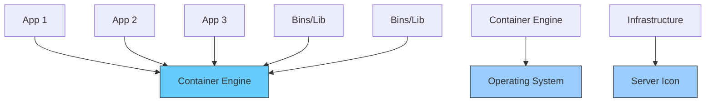
```mermaid
graph TD
    A["App 1"] --> D["Container Engine"]
    B["App 2"] --> D
    C["App 3"] --> D
    E["Bins/Lib"] --> D
    F["Bins/Lib"] --> D
    G["Container Engine"] --> H["Operating System"]
    I["Infrastructure"] --> J["Server Icon"]
    style D fill:#66ccff,stroke:#333
    style H fill:#99ccff,stroke:#333
    style J fill:#99ccff,stroke:#333
```

Containers

# 云计算时代的软件系统

- 虚拟化 Virtualization  
- 主要解决硬件资源弹性分配与整合问题

\- 两种实现方法

• Hypervisor v.s VMM

\- 主要的技术提供商

- VMware   
- Microsoft   
- Oracle

\- 发展方向: 超融合/SDDC

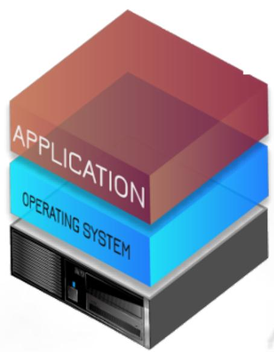

text_image

APPLICATION
OPERATING SYSTEM

Traditional Server Architecture

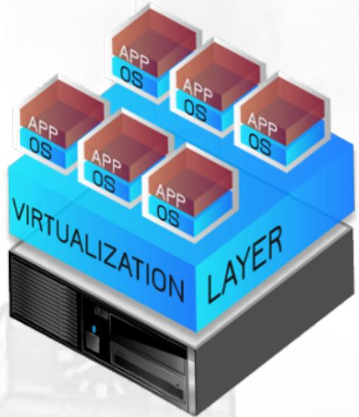

text_image

APP OS
APP OS
APP OS
APP OS
VIRTUALIZATION
LAYER

Virtualized Server Architecture

Hypervisor or Virtual Machine Monitor (VMM)  
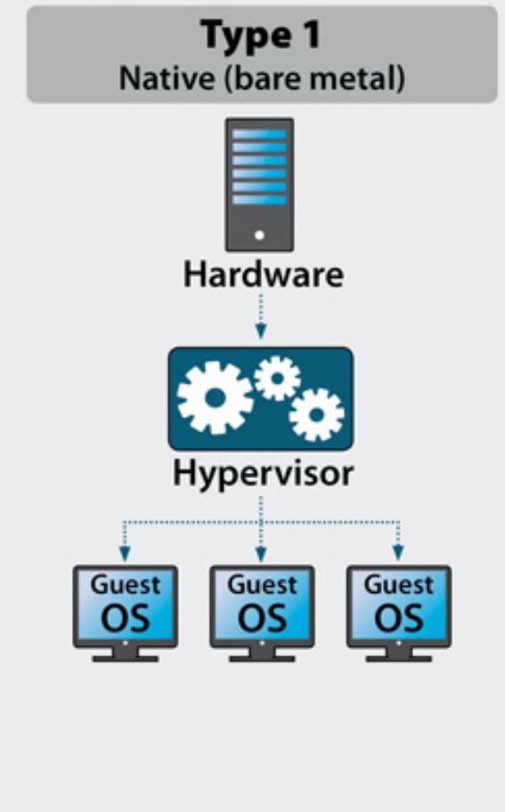

flowchart

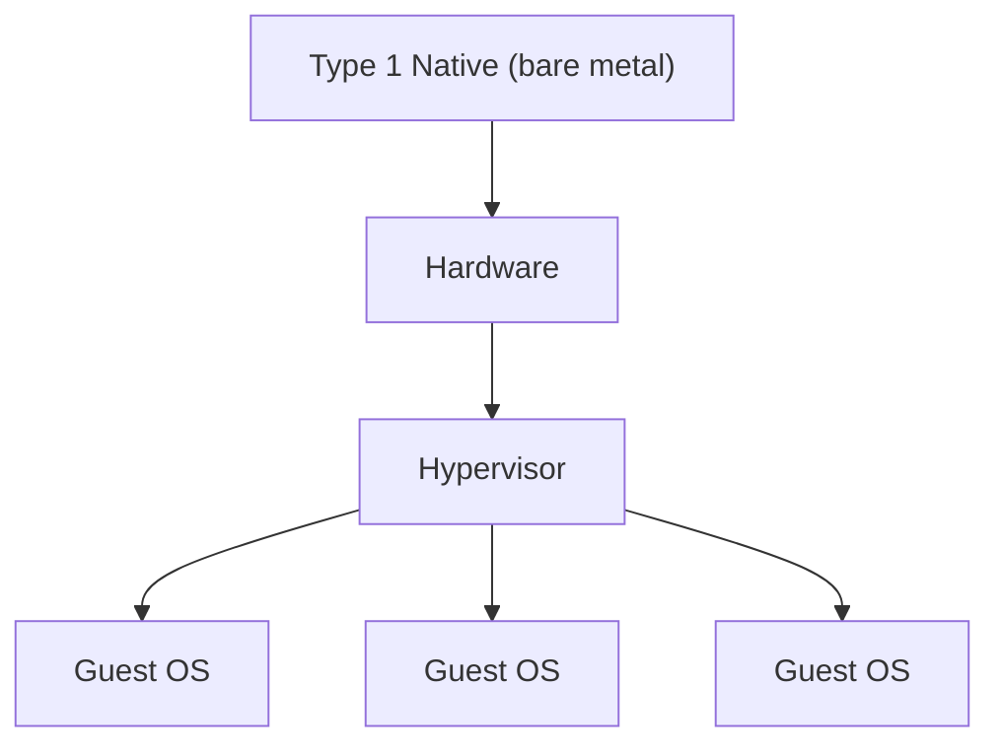
```mermaid
graph TD
    A["Type 1 Native (bare metal)"] --> B["Hardware"]
    B --> C["Hypervisor"]
    C --> D["Guest OS"]
    C --> E["Guest OS"]
    C --> F["Guest OS"]
```

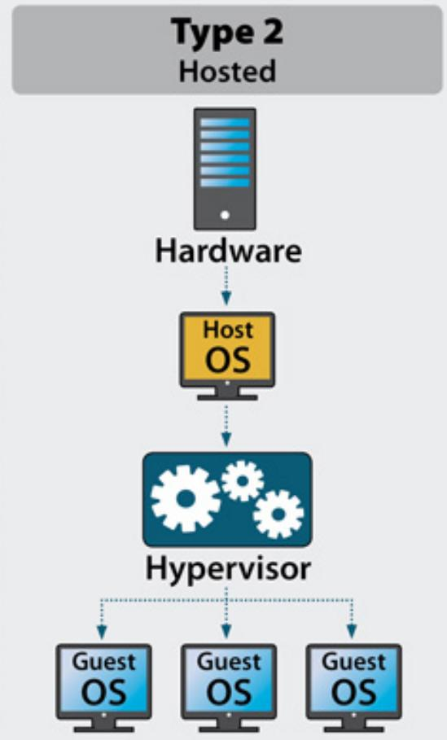

flowchart

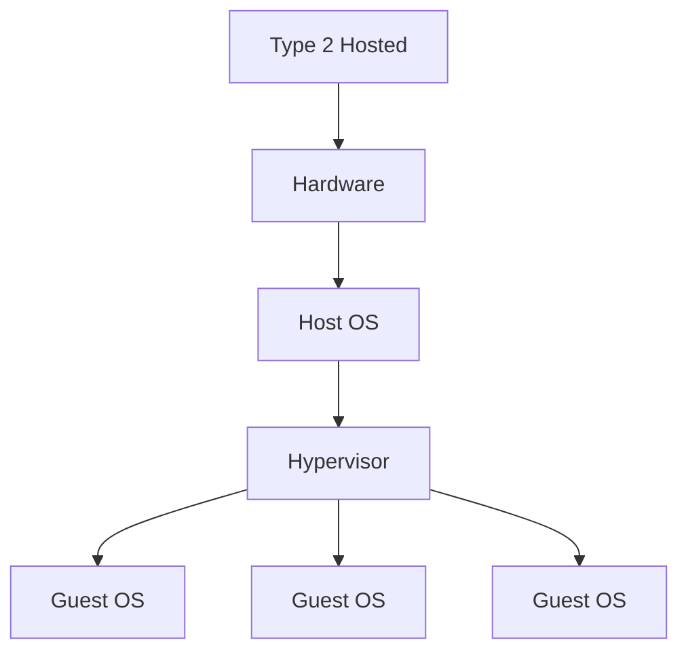
```mermaid
graph TD
    A["Type 2 Hosted"] --> B["Hardware"]
    B --> C["Host OS"]
    C --> D["Hypervisor"]
    D --> E["Guest OS"]
    D --> F["Guest OS"]
    D --> G["Guest OS"]
```

# 云计算时代的软件系统

- 虚拟化 Virtualization  
- 主要解决硬件资源弹性分配与整合问题

\- 两种实现方法

• Hypervisor v.s
VMM

\- 主要的技术提供商

- VMware   
- Microsoft   
- Oracle

\- 发展方向: 超融合/SDDC

• 超融合(Hyper-Convergence)  
- 计算、存储、网络的融合与统一调配  
- 支持实现软件定义的数据中心（SDDC）

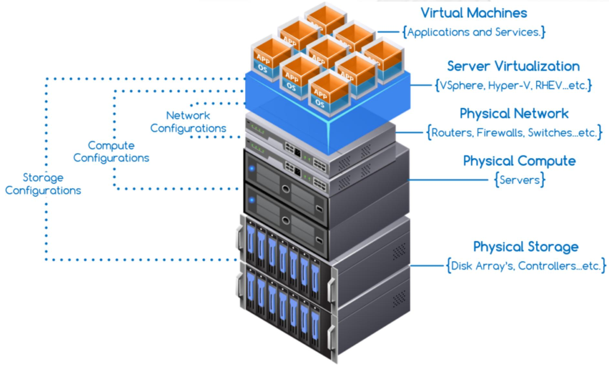

flowchart

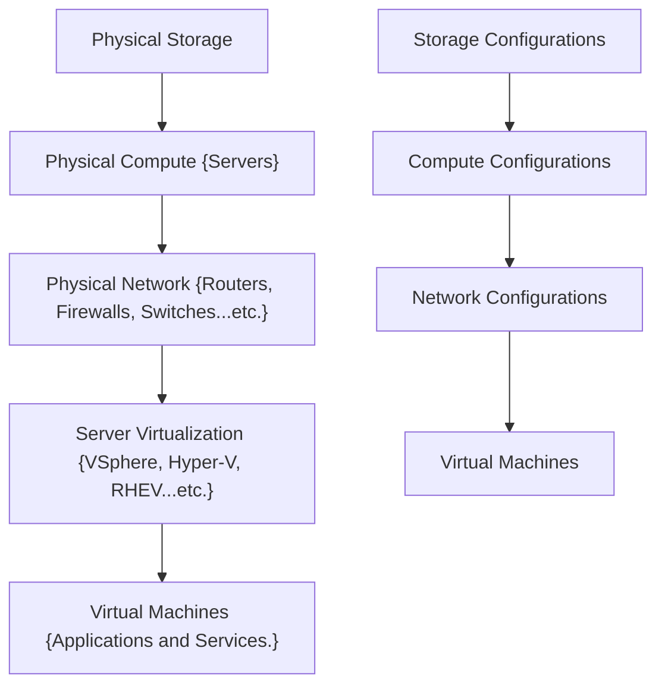
```mermaid
graph TD
    A["Physical Storage"] --> B["Physical Compute {Servers}"]
    B --> C["Physical Network {Routers, Firewalls, Switches...etc.}"]
    C --> D["Server Virtualization {VSphere, Hyper-V, RHEV...etc.}"]
    D --> E["Virtual Machines {Applications and Services.}"]
    F["Storage Configurations"] --> G["Compute Configurations"]
    G --> H["Network Configurations"]
    H --> I["Virtual Machines"]
```

# 云计算时代的软件系统

- 容器化 Containerization  
- 主要解决软件模块封装的问题  
- 全虚拟化过于重量级  
- Docker，事实/唯一标准，轻量极虚拟化、几乎没有性能损失  
- Kubernetes (K8s), 高层次协调/综合工具

text_image

APPLICATION
OPERATING SYSTEM

Traditional Server Architecture

text_image

APP OS
APP OS
APP OS
APP OS
VIRTUALIZATION
LAYER

Virtualized Server Architecture

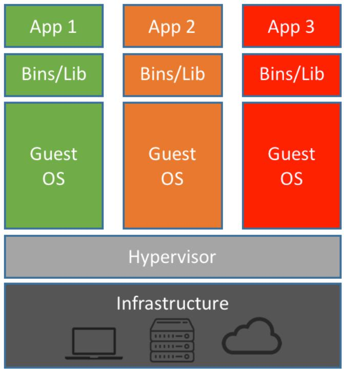

flowchart

```mermaid
graph TD
    A["App 1"] --> B["Bins/Lib"]
    C["App 2"] --> D["Bins/Lib"]
    E["App 3"] --> F["Bins/Lib"]
    G["Guest OS"] --> H["Guest OS"]
    I["Guest OS"] --> J["Guest OS"]
    K["Hypervisor"] --> L["Infrastructure"]
```

Machine Virtualization

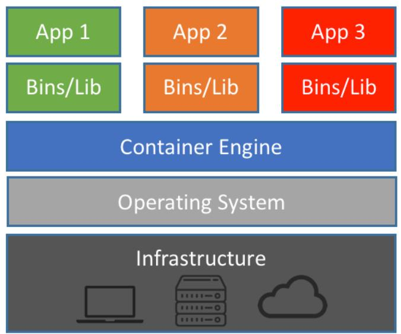

flowchart

```mermaid
graph TD
    A["App 1"] --> D["Container Engine"]
    B["App 2"] --> D
    C["App 3"] --> D
    E["Bins/Lib"] --> D
    F["Bins/Lib"] --> D
    G["Container Engine"] --> H["Operating System"]
    I["Infrastructure"] --> J["Server Icon"]
    style D fill:#66ccff,stroke:#333
    style H fill:#99ccff,stroke:#333
    style J fill:#99ccff,stroke:#333
```

Containers

# 云计算时代的软件系统

- 容器化 Containerization  
- 主要解决软件模块封装的问题  
- 全虚拟化过于重量级  
- Docker，事实/唯一标准，轻量极虚拟化、几乎没有性能损失  
- Kubernetes (K8s), 高层次协调/综合工具

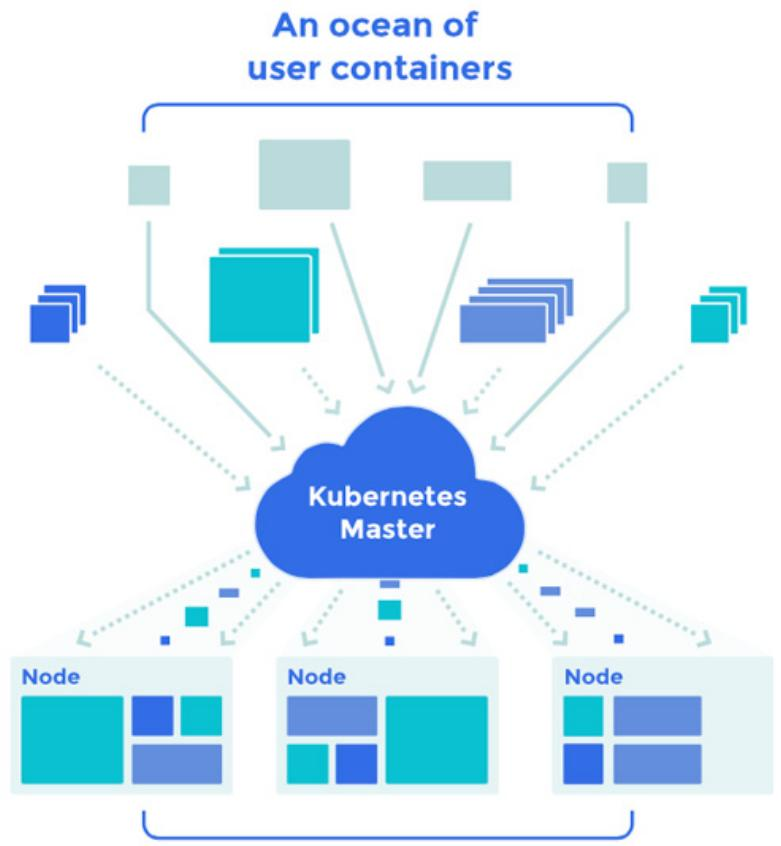

flowchart

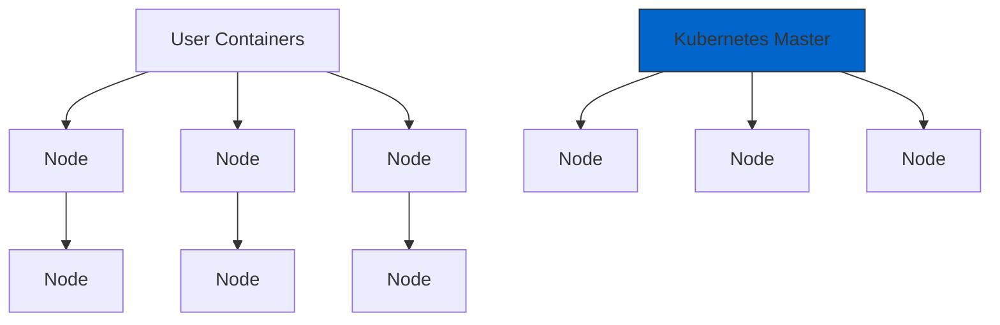
```mermaid
graph TD
    A["User Containers"] --> B["Node"]
    A --> C["Node"]
    A --> D["Node"]
    B --> E["Node"]
    C --> F["Node"]
    D --> G["Node"]
    H["Kubernetes Master"] --> I["Node"]
    H --> J["Node"]
    H --> K["Node"]
    style H fill:#0066cc,stroke:#333
```

Scheduled and packed dynamically onto nodes

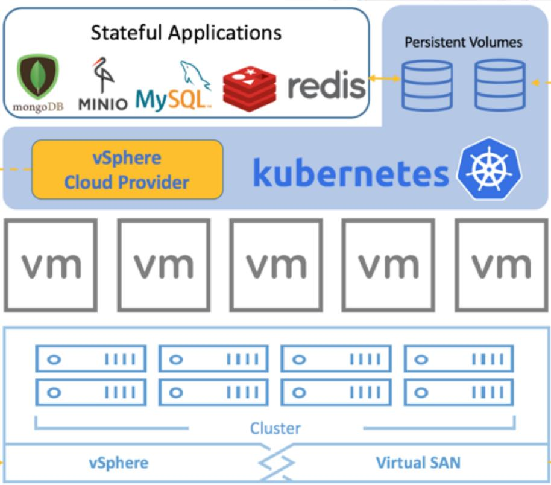

flowchart

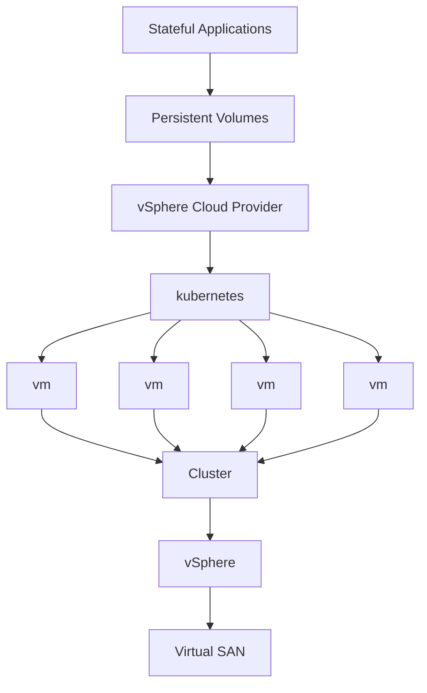
```mermaid
graph TD
    A["Stateful Applications"] --> B["Persistent Volumes"]
    B --> C["vSphere Cloud Provider"]
    C --> D["kubernetes"]
    D --> E["vm"]
    D --> F["vm"]
    D --> G["vm"]
    D --> H["vm"]
    E --> I["Cluster"]
    F --> I
    G --> I
    H --> I
    I --> J["vSphere"]
    J --> K["Virtual SAN"]
```

# 计算机硬件系统

# Von Neumann计算机

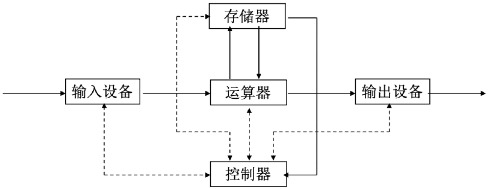

flowchart

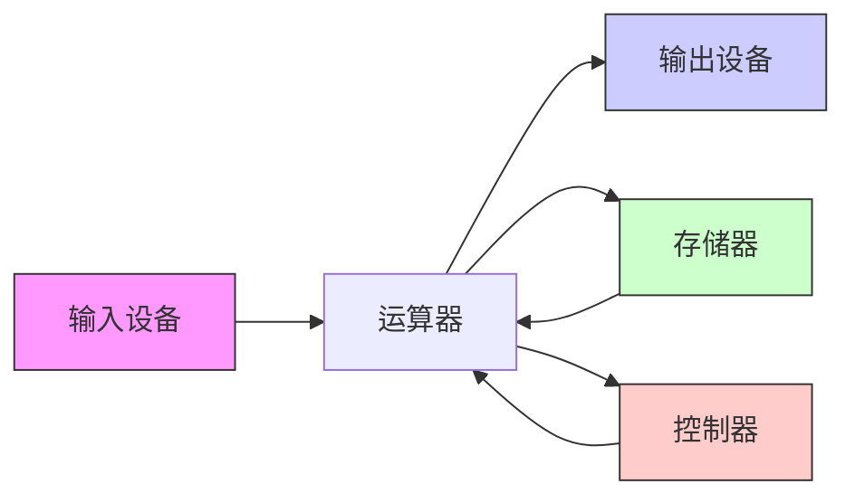
```mermaid
graph LR
    A["输入设备"] --> B["运算器"]
    B --> C["输出设备"]
    D["存储器"] --> B
    E["控制器"] --> B
    B --> D
    B --> E
    style A fill:#f9f,stroke:#333
    style C fill:#ccf,stroke:#333
    style D fill:#cfc,stroke:#333
    style E fill:#fcc,stroke:#333
```

- 虚线：控制流  
- 实线：数据流  
- 串行运行，存储与计算分离  
- 二进制

# 现代的计算机结构

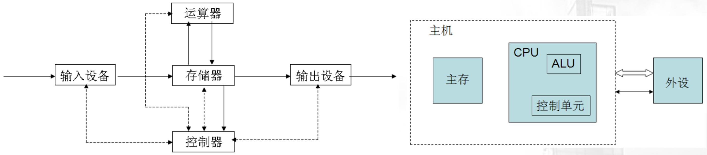

flowchart

```mermaid
graph LR
    A["输入设备"] --> B["运算器"]
    B --> C["存储器"]
    C --> D["输出设备"]
    D --> E["外设"]
    E --> F["CPU"]
    F --> G["ALU"]
    G --> H["控制单元"]
    H --> I["主存"]
    I --> J["控制器"]
    J --> C
    style A fill:#f9f,stroke:#333
    style E fill:#bbf,stroke:#333
    style F fill:#bfb,stroke:#333
    style G fill:#ffb,stroke:#333
    style H fill:#fbb,stroke:#333
    style I fill:#fbb,stroke:#333
    style J fill:#fbb,stroke:#333
```

\- 以存储为中心

- 层次化存储（第7章）  
- 总线结构（第8章）  
- 并行（第6、7、8、9章）

# 早期的计算机

\- 单总线结构: 将CPU、主存、I/O设备(通过I/O接口)都挂到一组总线上，简单但是：

- CPU、内存、I/O速度不匹配  
- 单总线过于繁忙，系统瓶颈

系统总线  
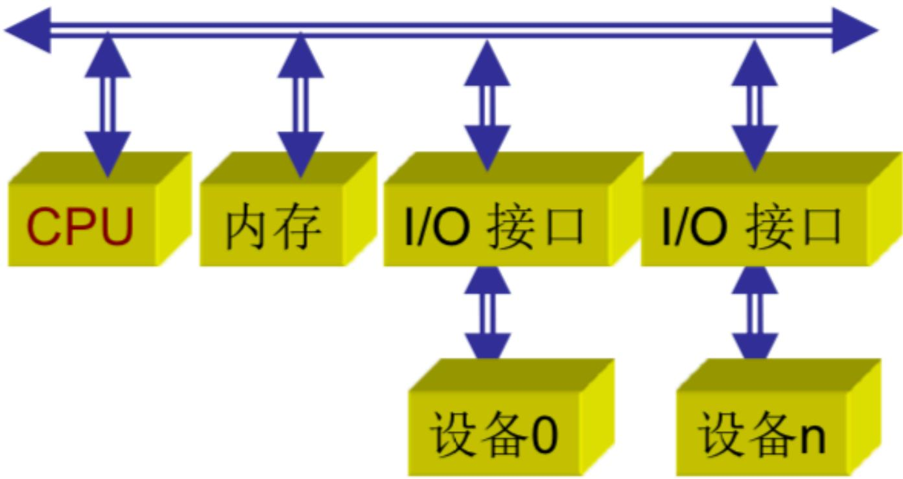

flowchart

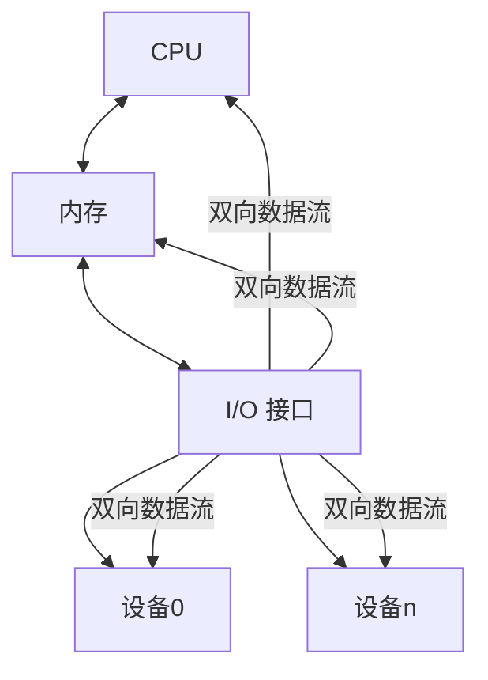
```mermaid
graph TD
    CPU["CPU"] <--> 内存["内存"]
    内存 <--> I/O接口["I/O 接口"]
    I/O接口 --> 设备0["设备0"]
    I/O接口 --> 设备n["设备n"]
    I/O接口 -->|双向数据流| CPU
    I/O接口 -->|双向数据流| 内存
    I/O接口 -->|双向数据流| 设备0
    I/O接口 -->|双向数据流| 设备n
```

# 80'至00'年代计算机

\- 20-10年前左右:北桥、南桥

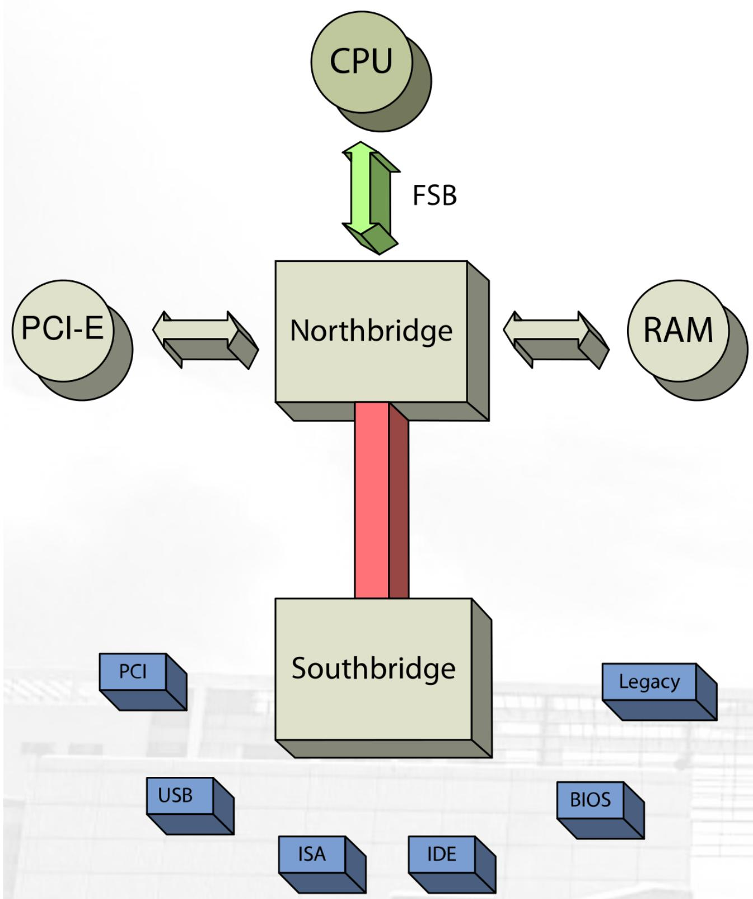

flowchart

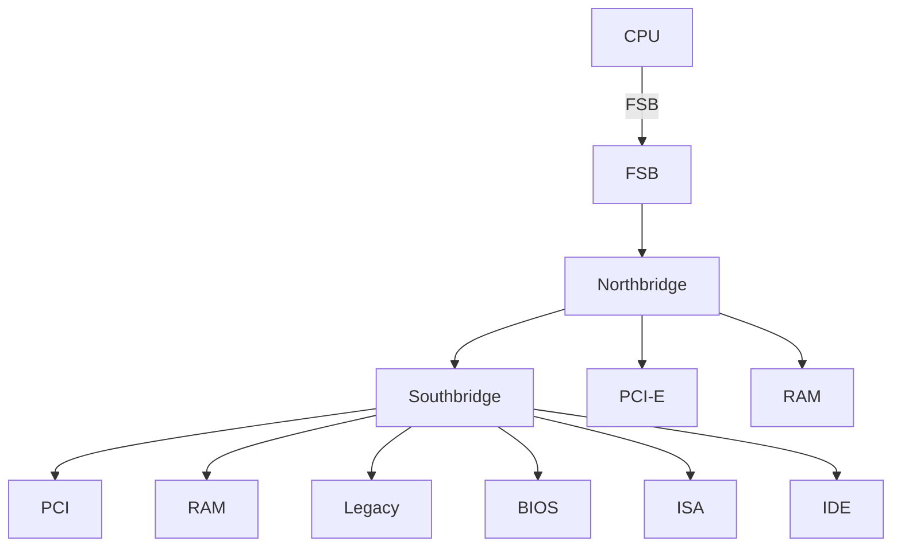
```mermaid
graph TD
    CPU["CPU"] -->|FSB| FSB["FSB"]
    FSB --> Northbridge["Northbridge"]
    Northbridge --> Southbridge["Southbridge"]
    Southbridge --> PCI["PCI"]
    Southbridge --> RAM["RAM"]
    Northbridge --> PCI_E["PCI-E"]
    Northbridge --> RAM_E["RAM"]
    Southbridge --> Legacy["Legacy"]
    Southbridge --> BIOS["BIOS"]
    Southbridge --> ISA["ISA"]
    Southbridge --> IDE["IDE"]
```

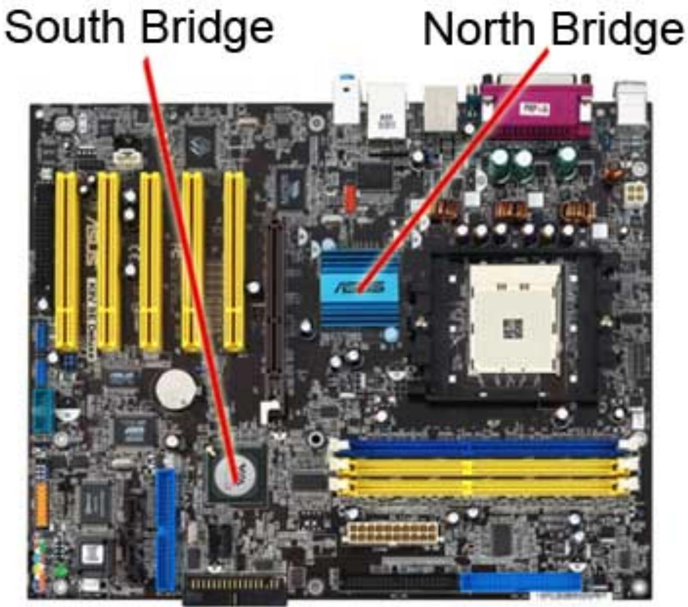

text_image

South Bridge
North Bridge

# 最新的发展趋势

\- 10年前左右至今，

\- CPU集成北桥，直连PCIE、内存、SSD...

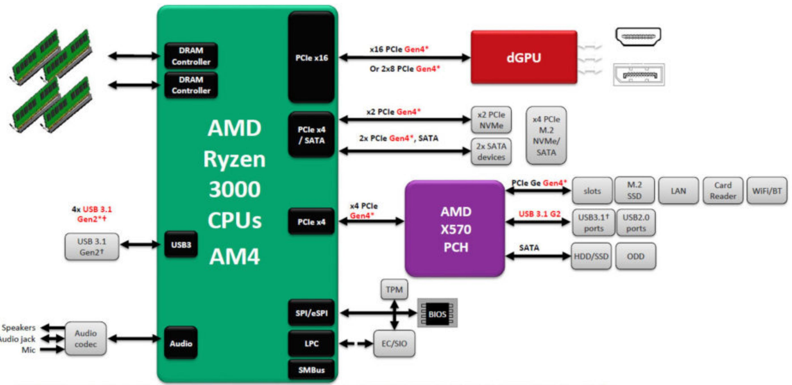

flowchart

```mermaid
graph TD
    A["DRAM Controller"] -->|x16 PCIe Gen4* Or 2x8 PCIe Gen4*| B["dGPU"]
    C["DRAM Controller"] -->|x16 PCIe Gen4* Or 2x8 PCIe Gen4*| B
    D["DRAM Controller"] -->|x2 PCIe Gen4* 2x PCIe Gen4*, SATA| E["x2 PCIe NVMe 2x SATA devices"]
    D -->|x2 PCIe Gen4* 2x PCIe Gen4*, SATA| F["x4 PCIe M.2 NVMe/SATA"]
    G["USB3"] -->|4x USB 3.1 Gen2*† USB 3.1 Gen2†| H["AMD X570 PCH"]
    I["Audio"] -->|Audio codec| J["Sipl/eSPI LPC SMBus"]
    K[" Speakers Audio jack Mic"] --> L["EC/SIO"]
    M["TPM"] --> N["BIOS"]
    O["USB 3.1"] --> H
    P["SATA"] --> N
    Q["SDS"] --> N
    R["SSD"] --> N
    S["SDS"] --> N
    T["SDS"] --> N
    U["SDS"] --> N
    V["SDS"] --> N
    W["SDS"] --> N
    X["SDS"] --> N
    Y["SDS"] --> N
    Z["SDS"] --> N
    AA["SDS"] --> N
    AB["SDS"] --> N
    AC["SDS"] --> N
    AD["SDS"] --> N
    AE["SDS"] --> N
    AF["SDS"] --> N
    AG["SDS"] --> N
    AH["SDS"] --> N
    AI["SDS"] --> N
    AJ["SDS"] --> N
    AK["SDS"] --> N
    AL["SDS"] --> N
    AM["SDS"] --> N
    AN["SDS"] --> N
    AO["SDS"] --> N
    AP["SDS"] --> N
    AQ["SDS"] --> N
    AR["SDS"] --> N
    AS["SDS"] --> N
    AT["SDS"] --> N
    AU["SDS"] --> N
    AV["SDS"] --> N
    AW["SDS"] --> N
    AX["SDS"] --> N
    AY["DRAM Controller"] --> AZ["DRAM Controller"]
    BA["DRAM Controller"] --> BB["DRAM Controller"]
    BC["PCIe x16"] --> BD["x16 PCIe Gen4* Or 2x8 PCIe Gen4*"]
    BE["PCIe x4 / SATA"] --> BF["x2 PCIe Gen4* 2x PCIe Gen4*, SATA"]
    BG["PCIe x4"] --> BH["x4 PCIe NVMe 2x SATA devices"]
    BI["PCIe x4"] --> BJ["x4 PCIe M.2 NVMe/SATA"]
    BK["PCIe x4"] --> BL["PCIe Ge Gen4* USB 3.1 G2"]
    BM["X570 PCH"] --> BN["slots USB3.1↑ ports HDD/SSD"]
    BN --> BO["M.2 SSD USB2.0 ports"]
    BP["X570 PCH"] --> BQ["SATA"]
    BR["X570 PCH"] --> BS["HDD/SSD ODD"]
```

# 计算机的分类

- 从规模划分  
- FLINN分类法

# 从规模划分计算机

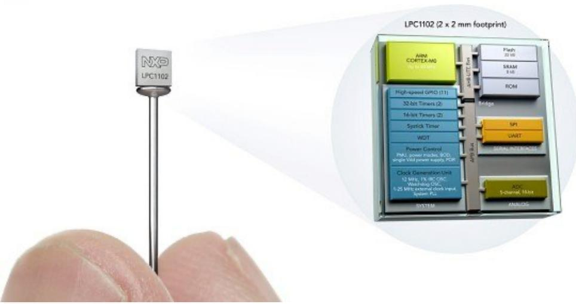

text_image

LPC1102 (2 x 2 mm footprint)
NXP
LPC1102
ARM
CORTEX-AMG
High-speed GPS (11)
32-bit Timers (2)
16-bit Timers (2)
Systick Timer
WOT
Power Control
PWM, power modules, BOD
single Vial power output, PWM
Clock Generation Unit
12 MHz, 15 MHz, 100 MHz
Wound gate, 700 MHz,
1.25 MHz external clock input
system bus
SYSTEM
Flash
22 dB
SRAM
5 dB
ROM
Bridge
SPI
UNIT
Signal Reference
AC
5-channel, 1kHz
ANALOG

MCU

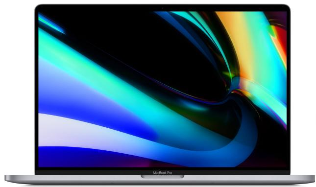

natural_image

Laptop screen displaying a colorful abstract wallpaper with blue and white gradients (no text or symbols visible)

笔记本电脑

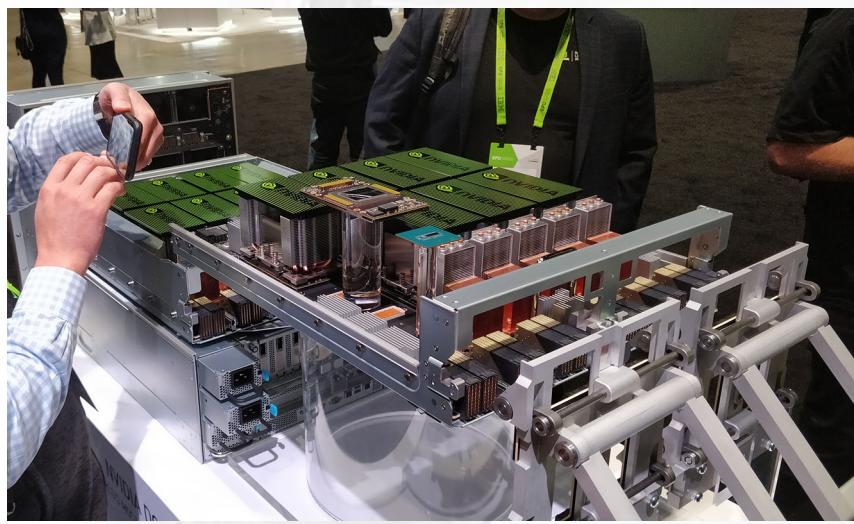

natural_image

Interior view of a semiconductor manufacturing facility with electronic components and a person adjusting a component (no visible text or symbols)

服务器

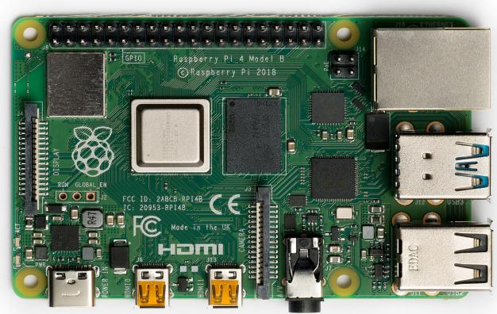

natural_image

Close-up of a Raspberry Pi 4 Model B board with visible components and labels (no readable text beyond branding)

树莓派

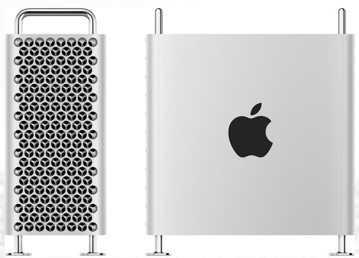

natural_image

Two Apple Award-shaped storage units shown side by side, one with a hexagonal patterned panel and the other with a black Apple logo (no text or symbols on the devices themselves)

工作站

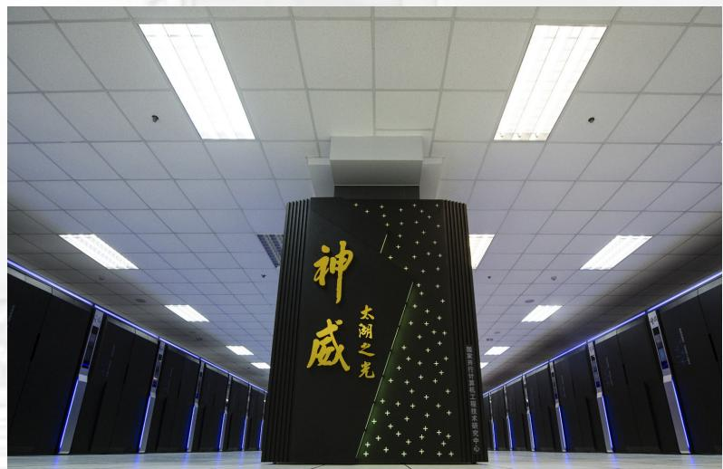

text_image

神威
太湖之光
国家自然科学基金中心

超算

natural_image

Side view of a modern smartphone with a black-and-white abstract wallpaper (no text or symbols visible)

智能手机

# 从规模划分计算机

截至2019年11月公布的超算TOP500名单中的前十名\*

<table><tr><td>排名</td><td>名称</td><td>国家和地区</td><td>场所</td><td>安装年份</td><td>供应商</td><td>处理器核心数</td><td>Rmax(Tflops)</td><td>Rpeak(Tflops)</td><td>功率(千瓦)</td></tr><tr><td>1</td><td>顶点</td><td>美国</td><td>橡树岭国家实验室</td><td>2018</td><td>国际商业机器公司</td><td>2,414,592</td><td>148,600.0</td><td>200,794.9</td><td>10,096</td></tr><tr><td>2</td><td>Sierra</td><td>美国</td><td>劳伦斯利佛摩国家实验室</td><td>2018</td><td>国际商业机器公司</td><td>1,572,480</td><td>94,640.0</td><td>125,712.0</td><td>7,438</td></tr><tr><td>3</td><td>神威·太湖之光</td><td>中华人民共和国</td><td>国家超级计算无锡中心</td><td>2016</td><td>国家并行计算机工程技术研究中心</td><td>10,649,600</td><td>93,014.6</td><td>125,435.9</td><td>15,371</td></tr><tr><td>4</td><td>天河-2</td><td>中华人民共和国</td><td>国家超级计算广州中心</td><td>2013</td><td>中国人民解放军国防科学技术大学</td><td>4,981,760</td><td>61,444.5</td><td>100,678.7</td><td>18,482</td></tr><tr><td>5 新</td><td>Frontera</td><td>美国</td><td>德克萨斯先进计算机中心</td><td>2019</td><td>Dell EMC</td><td>448,448</td><td>23,516.4</td><td>38,745.9</td><td>-</td></tr><tr><td>6▼</td><td>代恩特峰</td><td>瑞士</td><td>瑞士国家超级计算中心</td><td>2013</td><td>克雷公司</td><td>387,872</td><td>21,230.0</td><td>27,154.3</td><td>2,384</td></tr><tr><td>7▼</td><td>三位一体</td><td>美国</td><td>洛斯阿拉莫斯国家实验室</td><td>2015</td><td>克雷公司</td><td>979,072</td><td>20,158.7</td><td>41,461.2</td><td>7,578</td></tr><tr><td>8▼</td><td>AI桥接云基础架构</td><td>日本</td><td>东京大学</td><td>2018</td><td>富士通</td><td>391,680</td><td>19,880.0</td><td>32,576.6</td><td>1,649</td></tr><tr><td>9▼</td><td>SuperMUC</td><td>德国</td><td>莱布尼兹超级计算中心</td><td>2012</td><td>联想集团</td><td>305,856</td><td>19,476.6</td><td>26,873.9</td><td>-</td></tr><tr><td>10▲</td><td>Lassen</td><td>美国</td><td>劳伦斯利佛摩国家实验室</td><td>2018</td><td>国际商业机器公司英伟达迈络思</td><td>288,288</td><td>18,200.0</td><td>23,047.2</td><td>-</td></tr></table>

\*数据来源：https://www.top500.org/lists/2019/11/

# 从规模划分计算机

# 截至2023年11月公布的超算TOP500名单中的前十名\*

\*数据来源：https://

www.top500.org/lists/2023/11/

<table><tr><td>Rank</td><td>System</td><td>Cores</td><td>Rmax (PFlop/s)</td><td>Rpeak (PFlop/s)</td><td>Power (kW)</td></tr><tr><td>1</td><td>Frontier - HPE Cray EX235a, AMD Optimized 3rd Generation EPYC 64C 2GHz, AMD Instinct MI250X, Slingshot-11, HPE DOE/SC/Oak Ridge National LaboratoryUnited States</td><td>8,699,904</td><td>1,194.00</td><td>1,679.82</td><td>22,703</td></tr><tr><td>2</td><td>Aurora - HPE Cray EX - Intel Exascale Compute Blade, Xeon CPU Max 9470 52C 2.4GHz, Intel Data Center GPU Max, Slingshot-11, Intel DOE/SC/Argonne National LaboratoryUnited States</td><td>4,742,808</td><td>585.34</td><td>1,059.33</td><td>24,687</td></tr><tr><td>3</td><td>Eagle - Microsoft NDv5, Xeon Platinum 8480C 48C 2GHz, NVIDIA H100, NVIDIA Infiniband NDR, Microsoft Microsoft AzureUnited States</td><td>1,123,200</td><td>561.20</td><td>846.84</td><td></td></tr><tr><td>4</td><td>Supercomputer Fugaku - Supercomputer Fugaku, A64FX 48C 2.2GHz, Tofu interconnect D, FujitsuRIKEN Center for Computational ScienceJapan</td><td>7,630,848</td><td>442.01</td><td>537.21</td><td>29,899</td></tr><tr><td>5</td><td>LUMI - HPE Cray EX235a, AMD Optimized 3rd Generation EPYC 64C 2GHz, AMD Instinct MI250X, Slingshot-11, HPE EuroHPC/CSCFinland</td><td>2,752,704</td><td>379.70</td><td>531.51</td><td>7,107</td></tr><tr><td>6</td><td>Leonardo - BullSequana XH2000, Xeon Platinum 8358 32C 2.6GHz, NVIDIA A100 SXM4 64 GB, Quad-rail NVIDIA HDR100 Infiniband, EVIDENEuroHPC/CINECAItaly</td><td>1,824,768</td><td>238.70</td><td>304.47</td><td>7,404</td></tr><tr><td>7</td><td>Summit - IBM Power System AC922, IBM POWER9 22C 3.07GHz, NVIDIA Volta GV100, Dual-rail Mellanox EDR Infiniband, IBM DOE/SC/Oak Ridge National LaboratoryUnited States</td><td>2,414,592</td><td>148.60</td><td>200.79</td><td>10,096</td></tr><tr><td>8</td><td>MareNostrum 5 ACC - BullSequana XH3000, Xeon Platinum 8460Y+ 40C 2.3GHz, NVIDIA H100 64GB, Infiniband NDR200, EVIDENEuroHPC/BSCSpain</td><td>680,960</td><td>138.20</td><td>265.57</td><td>2,560</td></tr><tr><td>9</td><td>Eos NVIDIA DGX SuperPOD - NVIDIA DGX H100, Xeon Platinum 8480C 56C 3.8GHz, NVIDIA H100, Infiniband NDR400, Nvidia NVIDIA CorporationUnited States</td><td>485,888</td><td>121.40</td><td>188.65</td><td></td></tr><tr><td>10</td><td>Sierra - IBM Power System AC922, IBM POWER9 22C 3.1GHz, NVIDIA Volta GV100, Dual-rail Mellanox EDR Infiniband, IBM / NVIDIA / MellanoxDOE/NNSA/LLNLUnited States</td><td>1,572,480</td><td>94.64</td><td>125.71</td><td>7,438</td></tr></table>

# 从规模划分计算机

\- 规模，意味着什么？

\- 更大的面积、体积

\- 装入更多的计算、存储

●
■ ■ ■ ■

\- 规模，不意味着什么？

\- 不同的计算单元配置(CPU、GPU、FPGA、ASIC)

\- 不同的构架(存储、网络、集群、IO...)

\- 不同的面向应用的性能

# FLYNN分类法

1972年，费林(Michael J. Flynn)根据计算机在执行程序的过程中信息流(Information Stream)的特征将其分为可分成指令(Instruction)、数据(Data)、和控制(Control)三种信息流。

指令流(IS): 机器执行的指令序列, 它由存储器流入控制单元(CU)。

数据流(DS): 由指令流所使用的数据, 包括输入数据、中间数据和结果。数据在处理单元(PU)中处理。

控制流(CS): 指令流进入CU, 由CU产生一系列的控制流(信号), 在控制流的控制下完成指令的功能。

# FLYNN分类法

Flynn提出的四类计算机

<table><tr><td></td><td>单指令流</td><td>多指令流</td></tr><tr><td>单数据流</td><td>单指令流单数据流(SISD)</td><td>多指令流单数据流(MISD)</td></tr><tr><td>多数据流</td><td>单指令流多数据流(SIMD)</td><td>多指令流多数据流(MIMD)</td></tr></table>

# FLYNN分类法

# a. 单指令流单数据流(SISD)计算机

该型计算机由一个控制单元，一个处理单元和一个主存储器组成。

每次从存储器取一条指令到控制器，由控制器对指令译码后产生控制信号，控制处理单元完成指令规定的功能。

这是最简单的一类计算机。

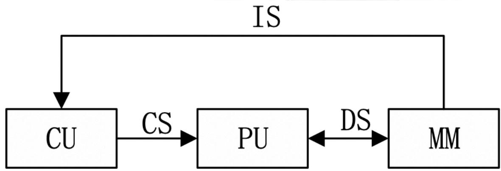

flowchart

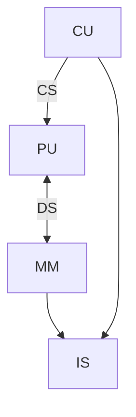
```mermaid
graph TD
    CU -->|CS| PU
    PU <-->|DS| MM
    MM --> IS
    CU --> IS
```

CU:控制单元；PU:处理单元；MM:主存储器

IS:指令流；CS:控制流；DS:数据流

# FLYNN分类法

# b. 单指令流多数据流(SIMD)计算机

该型计算机由一个控制单元，多个处理单元和多个存储器模块组成。

每次从存储器取一条指令到控制器，由控制器对指令译码后产生多种相同控制信号，并将相同控制命令分别下到多个处理单元上，控制多个处理单元执行相同的操作，完成这条指令对多个数据的处理。最终实现一条指令所规定的功能。

SIMD的一个例子就是一个数组或向量处理系统，它可以对不同的数据并行执行相同的操作。例如有数据4、5和3、2，一个单指令执行两个独立的加法运算：4+5和3+2，就被称为单指令流多数据流。SSE, AVX, AVX2, AVX-512 48

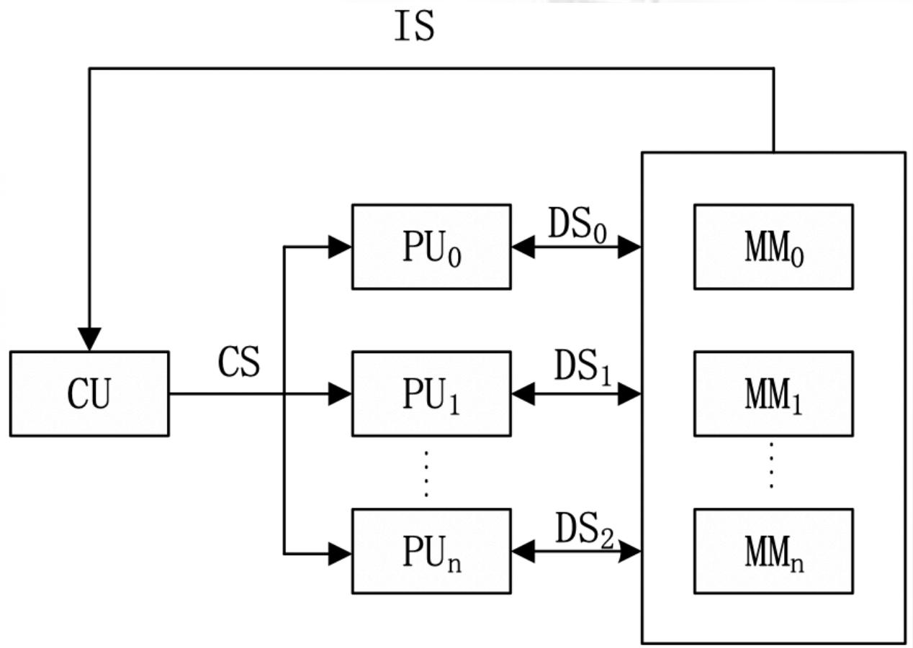

flowchart

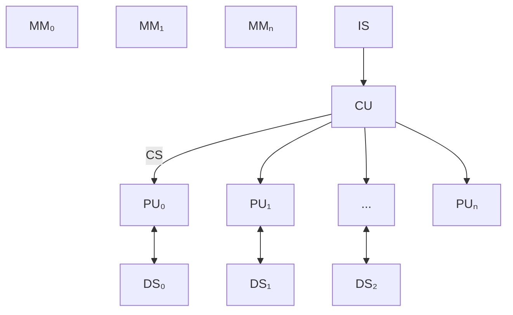
```mermaid
graph TD
    CU -->|CS| PU0["PU₀"]
    CU --> PU1["PU₁"]
    CU --> ...[...]
    CU --> PUn["PUₙ"]
    PU0 <--> DS0["DS₀"]
    PU1 <--> DS1["DS₁"]
    ... <--> DS2["DS₂"]
    MM0["MM₀"]
    MM1["MM₁"]
    ...[...]
    MMn["MMₙ"]
    IS --> CU
```

CU:控制单元；PU:处理单元；MM:主存储器

IS:指令流；CS:控制流；DS:数据流

# FLYNN分类法

# c. 多指令流单数据流(MISD)计算机

该型计算机的含义是由多个控制单元同时执行多条指令对同一数据进行处理。

这类型计算机尚无实例。

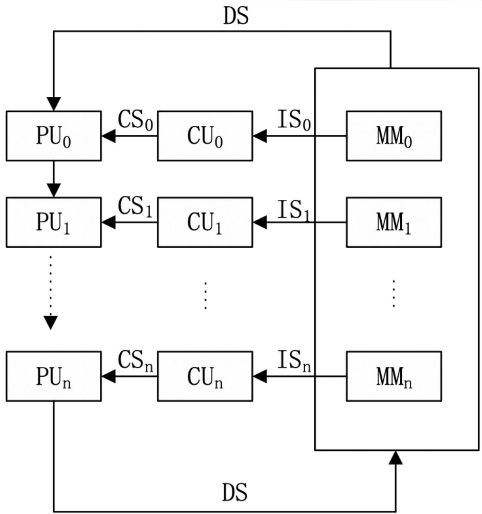

flowchart

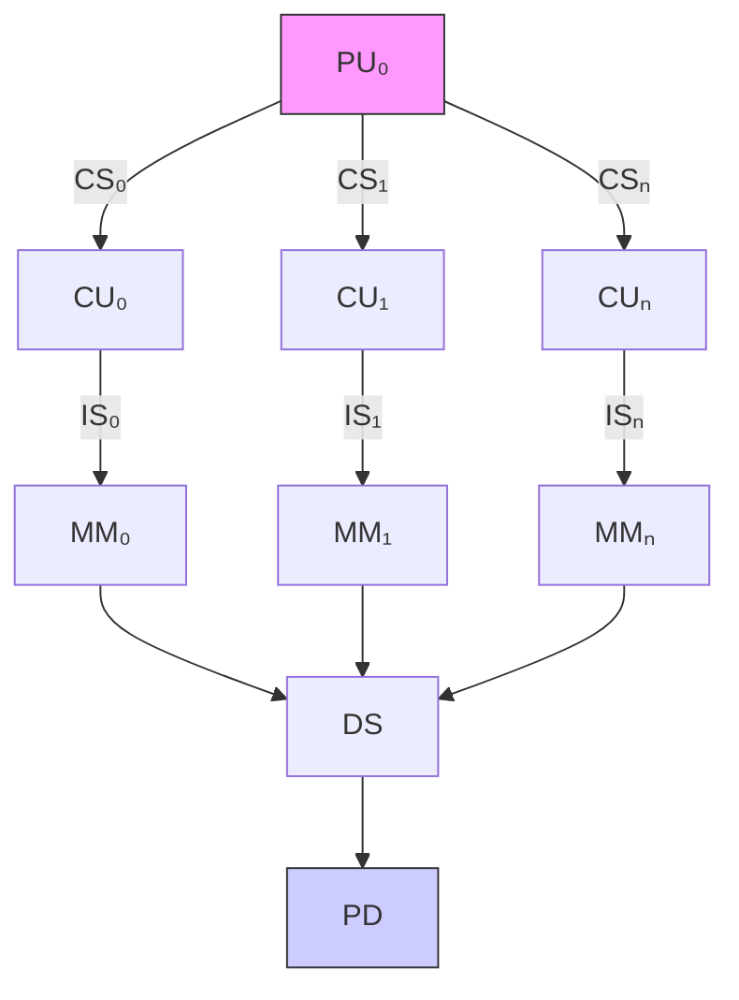
```mermaid
graph TD
    A["PU₀"] -->|CS₀| B["CU₀"]
    A -->|CS₁| C["CU₁"]
    A -->|CSₙ| D["CUₙ"]
    B -->|IS₀| E["MM₀"]
    C -->|IS₁| F["MM₁"]
    D -->|ISₙ| G["MMₙ"]
    E --> H["DS"]
    F --> H
    G --> H
    H --> I["PD"]
    style A fill:#f9f,stroke:#333
    style I fill:#ccf,stroke:#333
```

CU:控制单元；PU:处理单元；MM:主存储器

IS:指令流；CS:控制流；DS:数据流

# FLYNN分类法

# d. 多指令流多数据流(MIMD)计算机

该型计算机由多个控制单元，多个处理单元和多个存储器模块组成，实际上是由多处理机由某种方式连接在一起构成的计算机系统，通常称为多处理机系统。

这类计算机是各个处理机分别执行多条指令，处理多个数据，并行工作而实现某种功能。

当前市面上的多核处理器、多计算机集群系统都属于这一类计算机。

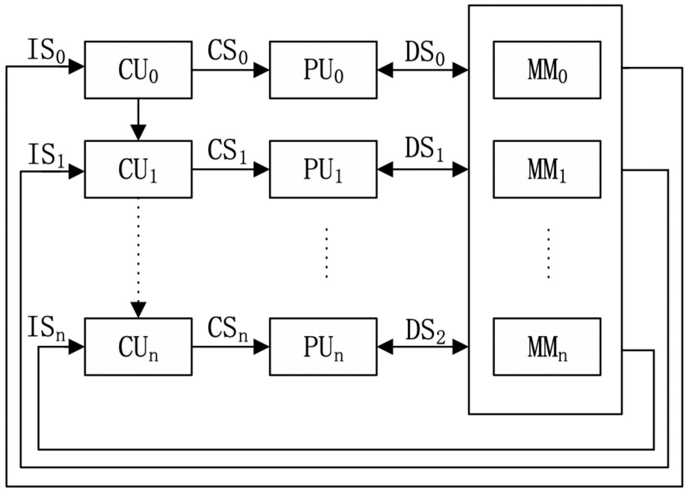

flowchart

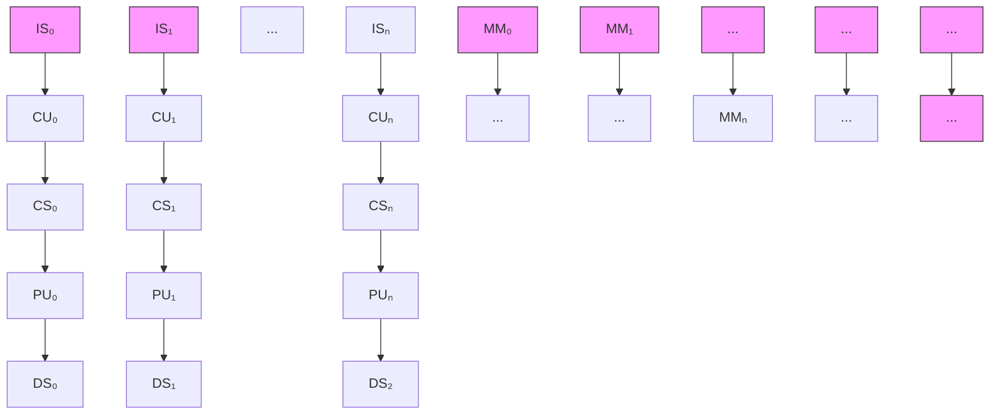
```mermaid
graph TD
    A["IS₀"] --> B["CU₀"]
    B --> C["CS₀"]
    C --> D["PU₀"]
    D --> E["DS₀"]
    F["IS₁"] --> G["CU₁"]
    G --> H["CS₁"]
    H --> I["PU₁"]
    I --> J["DS₁"]
    K["..."]
    L["ISₙ"] --> M["CUₙ"]
    M --> N["CSₙ"]
    N --> O["PUₙ"]
    O --> P["DS₂"]
    Q["MM₀"] --> R["..."]
    S["MM₁"] --> T["..."]
    U["..."] --> V["MMₙ"]
    W["..."] --> X["..."]
    Y["..."] --> Z["..."]
    style A fill:#f9f,stroke:#333
    style F fill:#f9f,stroke:#333
    style Q fill:#f9f,stroke:#333
    style S fill:#f9f,stroke:#333
    style U fill:#f9f,stroke:#333
    style W fill:#f9f,stroke:#333
    style Y fill:#f9f,stroke:#333
    style Z fill:#f9f,stroke:#333
```

CU:控制单元；PU:处理单元；MM:

主存储器

IS:指令流；CS:控制流；DS:数据流

# 那么，现代的计算机呢？

\- 性能取向型，多核 + 异构 + (可编程)加速硬件，代表产品：

- 各种尝试学习工作站：GPU + CPU  
• Mac, M3 Max, CPU + GPU + NPU(ASIC)  
• Xilinx Zynq 7000, ARM Cortex A9 + FPGA

• 功耗、尺寸、成本取向型，代表产品：

• Nvidia Jetson (ARM A77 + GPU)

\- 各种尺寸、价格的MCU...

\- 各类RISC-V开源CPU实现...

# 未来的软件与硬件

# 几个未来的关键趋势

- 硬件异构  
- 软件定义的计算 v.s 硬件实现的计算  
- 异构多模态编程

# 异构计算

\- CPU不能包打天下

\- GPU也不行

\- TPU也不行

\- 没有包打天下的平台...

• Why?

\- 不同应用的计算需求不同

\- 典型的游戏大作

• CPU 20%, GPU 80%

\- 编译

\- CPU 100%

\- 信息管理

\- CPU 100%

\- 渲染

• CPU 10%, GPU 90%

\- 各类可并行的科学计算

• CPU 5%, GPU 95%

\- 各类DSP、高吞吐、高性能

• CPU 5%, FPGA/ASIC 95%

# 软件定义的计算

\- Software Defined Everything (SD-X)

• SDDC   
- SD Network 软件定义网络  
- SD Radio 软件定义无线电

\- 3G/4G/5G BBU模块

- SD Radar 软件定义雷达  
• SD Everything ....

\- Firmware

\- 各种固件，小到鼠标、手环、显示器、到CPU（微指令）全是软件在驱动；

\- 在非性能严格领域，纯硬件的边界在不断退缩；

# 硬件实现的计算

\- 高性能计算领域，硬件仍然是王道

- GPU   
- 高频交易HFT   
- 数字信号处理DSP  
- 挖矿   
- 各类算法专门加速芯片

\- 深度学习TPU（定制GPU）

\- Rendering、DL、CEM、CFD...

\- 硬件的可编程性
- FPGA、PLA等

# Heterogeneous Programming

- ASIC无法编程  
- FPGA可编程  
- GPU/TPU可编程  
- CPU可编程  
- 但每种硬件构架针对不同计算的性能差异极大，如何编程？

• Available options:

• OPENCL (CPU/GPU/FPGA)   
- Intel OneAPI   
- Cuda   
- Matal / Vulkan   
- TensorFlow   
●
...

# 那么，大家应该如何选择学习/研究方向？

\- GPT可以取代初级码农

\- 但是，是对项目经理能力的倍增器

• How to be a Project manager?

- 下至硬件/FPGA，上至learning算法，啥都要知道  
- GPT时间，“知道”远比“会用”重要